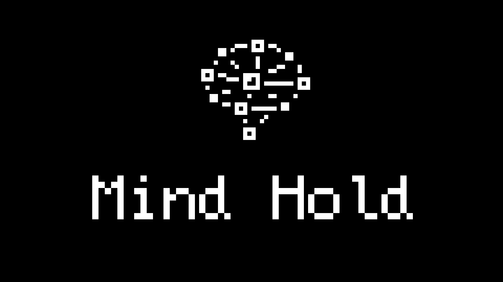

# Hold Mind - Technical Documentation

> *“Unleash the power of your mind. Hold. Think.”*

Добро пожаловать в техническую документацию к мобильной игре "Hold Mind"! Этот проект представляет собой мобильную игру в жанре clicker, где игроки удерживают индикатор для накопления "концентрации" и решения повседневных проблем.

## Содержание документации

- **[Gameplay](./Gameplay/README.md)** — описание игровых механик, навыков и улучшений.
- **[Architecture](./Architecture/README.md)** — архитектура приложения, управление состоянием и организация кода.
- **[UI](./UI/README.md)** — детали пользовательского интерфейса и взаимодействий.
- **[Assets](./Assets/README.md)** — управление ассетами, включая иконки.

## Дальнейшее добавление функционала
*Планируемые улучшения:*
- ~~Основная механика прогресс бара~~
- ~~Шкалы опыта и внутриигровой валюты~~
- ~~Генерация "проблем"~~
- ~~Упрощенная внутриигровая статистика~~
- Механизм улучшения геймплейных показателей
- Функционал настроек в приложении
- Функционал управления аккаунтами
- ...

## Репозиторий проекта

Полный код проекта доступен на GitHub:
[https://github.com/Dozixary57/mind-hold-mobile-project](https://github.com/Dozixary57/mind-hold-mobile-project)
